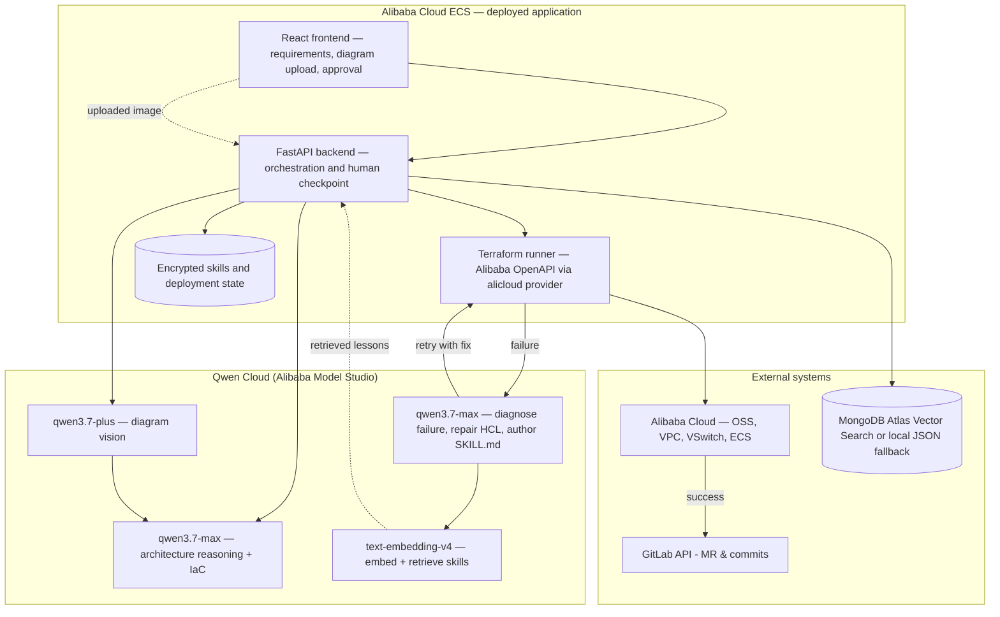

# Sky Launchpad

**An autopilot agent for cloud infrastructure that learns from its own failures.** Turn **natural language** or an **uploaded architecture diagram** into **Terraform**, **deploy it for real to Alibaba Cloud**, and — when a deploy fails — **diagnose, repair, and remember the fix** so the same failure never happens twice. Reasoning, vision, embeddings, and speech all run on **Qwen models on Qwen Cloud**.

- **Primary UX:** Web app under [`project/`](project/) (Vite + FastAPI): requirements → architecture → Terraform → **real `terraform apply`** → optional GitLab MR on success, with a **human-in-the-loop deploy checkpoint**.
- **The differentiator:** a **persistent, self-improving memory** — every deploy failure becomes a reusable `SKILL.md`, embedded and retrieved by vector similarity to pre-empt recurrence.

## Built for the Global AI Hackathon with Qwen Cloud — Track 4: Autopilot Agent

Track 4 asks for *"agents that automate real-world business workflows end-to-end with minimal human input."* Sky Launchpad automates the full infrastructure workflow — **design → generate IaC → deploy → validate → commit → learn** — with human checkpoints only where they matter (approving a real deploy).

**Qwen Cloud is load-bearing across every stage:**

| Role | Model | Endpoint |
|---|---|---|
| Architecture reasoning + IaC generation | **`qwen3.7-max`** | Qwen Cloud (OpenAI-compatible) |
| Failure repair + skill authoring | **`qwen3.7-max`** | Qwen Cloud |
| Diagram vision (screenshot → structured JSON) | **`qwen3.7-plus`** | Qwen Cloud |
| Skill-retrieval embeddings | **`text-embedding-v4`** (1024-d) | Qwen Cloud |
| Speech-to-text (voice input) | **`qwen3-asr-flash`** | Qwen Cloud |

Everything speaks the OpenAI wire format ([`project/backend/llm_client.py`](project/backend/llm_client.py)) through a single DashScope endpoint, so one API key and a model name drive every capability.

**The deployed workload runs on Alibaba Cloud too.** The app generates `alicloud` Terraform ([`deployer/iac_generator.py`](deployer/iac_generator.py) → OSS + VPC + VSwitch + security group) and applies it to Alibaba Cloud, and the backend itself is hosted on Alibaba Cloud (Simple Application Server / ECS) for the hackathon's proof-of-deployment.

### The self-improving loop (persistent memory)

When a deployment **fails**, Sky Launchpad doesn't just patch and forget. It **learns**:

1. **[`deployer/log_collector.py`](deployer/log_collector.py)** gathers the Terraform error context.
2. **[`deployer/repair_agent.py`](deployer/repair_agent.py)** hands it to **`qwen3.7-max`**, which diagnoses the root cause, fixes the HCL, and **authors a generalized `SKILL.md`**. Its persona is declared in [`deployer/AGENTS.md`](deployer/AGENTS.md).
3. **[`deployer/skill_library.py`](deployer/skill_library.py)** persists the lesson to **both** a versioned `skills/learned/<slug>/SKILL.md` **and** a retrieval index, embedding it with `text-embedding-v4`.
4. **Transfer:** the next deployment retrieves matching learned skills by vector similarity and injects them into generation — so the **same failure never happens twice**.
5. **[`project/backend/narration.py`](project/backend/narration.py)** streams a live narration of the loop over a WebSocket (the browser speaks it aloud).

The system becomes more useful the more it is used — with **no human editing skills**. Learned-skill metrics are exposed at `GET /api/skills/learned`.

### Run it

**1. Get a Qwen Cloud key** at [home.qwencloud.com/api-keys](https://home.qwencloud.com/api-keys) and configure the app:

```bash
cd project
cp .env.example .env
# set DASHSCOPE_API_KEY=sk-...   (pay-as-you-go key -> the dashscope-intl base URL;
#                                 sk-sp-... token-plan key -> set LLM_BASE_URL to the
#                                 token-plan URL. Mixing them returns 401.)
```

**2. Run locally:**

```bash
pip install -r backend/requirements.txt
npm install && npm run dev        # UI → http://localhost:5173

# second terminal, from project/
uvicorn backend.api.main:app --reload --host 0.0.0.0 --port 8000
```

**3. Prove Qwen Cloud is doing the work:**

```bash
curl https://dashscope-intl.aliyuncs.com/compatible-mode/v1/embeddings \
  -H "Authorization: Bearer $DASHSCOPE_API_KEY" -H 'Content-Type: application/json' \
  -d '{"model":"text-embedding-v4","input":"instance type not available in zone","dimensions":1024}' \
  | jq '.data[0].embedding | length'      # -> 1024
```

**One-time**, after creating the Atlas vector index with `numDimensions: 1024`:

```bash
python3 scripts/migrate_vector_index.py
```

To **deploy real infrastructure**, upload an Alibaba Cloud RAM AccessKey in **Settings → Alibaba Cloud** (or `POST /api/credentials/upload?provider=alicloud`), then run a deployment.

## How it works



1. User selects a provider — **Alibaba Cloud, AWS, GCP, or Azure** — and enters requirements **or** uploads an architecture image (**`qwen3.7-plus`** reads the diagram and returns structured JSON).
2. **`qwen3.7-max`** produces architecture JSON, informed by **`AGENTS.md`**, **`skills/`**, and any **learned skills** retrieved by vector similarity. Terraform is then generated by [`deployer/iac_generator.py`](deployer/iac_generator.py).
3. **FastAPI** runs **`terraform init/plan/apply`** against the target cloud using encrypted stored credentials (`deployer/` module at repo root).
4. On **success**, validated files are committed and a **merge request** is opened via the **GitLab REST API** (optional). On **failure**, the repair loop runs and the lesson is embedded back into step 2.

## Repository layout

| Path | Purpose |
|------|---------|
| [`project/`](project/) | **React + Vite** frontend and **FastAPI** backend (`project/backend/`) |
| [`deployer/`](deployer/) | Credential handling, Terraform workspace, deploy / retry / repair / GitLab save |
| [`skydb/`](skydb/) | MongoDB Atlas store + Vector Search retrieval (local JSON fallback) |
| [`skills/`](skills/) | Reusable SKILL.md modules (Terraform, security, cost, patterns) + `learned/` |
| [`examples/terraform/`](examples/terraform/) | Reference Terraform implementations |
| [`Dockerfile.backend`](Dockerfile.backend) | Backend image (Terraform pre-installed) for Alibaba Cloud hosting |

## Deploying the app to Alibaba Cloud (proof of deployment)

The reproducible proof deployment is defined in
[`infra/alibaba/backend/main.tf`](infra/alibaba/backend/main.tf). It provisions
a pay-as-you-go ECS instance, VPC, VSwitch, security group, public IP, and SSH
key pair through Alibaba Cloud APIs, then the deployment script installs the
full Dockerized UI/backend:

```bash
export ALICLOUD_ACCESS_KEY=... ALICLOUD_SECRET_KEY=...
export CONFIRM_ALIBABA_DEPLOY=yes
./scripts/deploy-alibaba-backend.sh
```

The script prints the public application and `/health` URLs. Capture those URLs
and the ECS instance in Alibaba Cloud Workbench for submission proof. Release
the pay-as-you-go resources after judging with
`CONFIRM_ALIBABA_DESTROY=yes ./scripts/destroy-alibaba-backend.sh`.

## Technology

| Layer | Stack |
|-------|--------|
| Inference | **Qwen Cloud** — `qwen3.7-max`, `qwen3.7-plus`, `text-embedding-v4`, `qwen3-asr-flash` |
| Backend | **FastAPI**, **Terraform** CLI, **GitLab REST** |
| Frontend | **React 18**, **TypeScript**, **Vite**, **Tailwind** |
| Deploy target | **Alibaba Cloud** (`alicloud` Terraform: OSS, VPC, VSwitch) — plus AWS/GCP/Azure |
| App hosting | **Alibaba Cloud** Simple Application Server / ECS |
| Skill retrieval | **MongoDB Atlas Vector Search** (1024-d, cosine) |
| Voice | **`qwen3-asr-flash`** (input) + browser SpeechSynthesis (output; CosyVoice available as a server-side upgrade) |

## Models & licensing

Every model in the inference path is a **Qwen model served on Qwen Cloud** (Alibaba Cloud Model Studio) via the OpenAI-compatible API — commercial, hosted, and accessed with a single `DASHSCOPE_API_KEY`. The hackathon provides free trial credits.

| Component | License | Notes |
|---|---|---|
| **Qwen models** (`qwen3.7-max`, `qwen3.7-plus`, `text-embedding-v4`, `qwen3-asr-flash`) | Commercial API (Qwen Cloud) | Hosted; not self-run. |
| **FastAPI**, **React**, **Vite**, **pymongo** | MIT / Apache 2.0 | Application frameworks. |
| **Terraform CLI** (1.7.5) | **BUSL-1.1** | Not open source since v1.6. We only *invoke* the CLI. Swap in [OpenTofu](https://opentofu.org) (MPL-2.0) for a fully open toolchain. |
| **alicloud / google / aws Terraform providers** | MPL-2.0 / Apache 2.0 | Deploy-time only. |

> GitLab is used only as the **git host** for committing validated Terraform and opening merge requests on success. It is optional — leave `GITLAB_TOKEN` unset to disable it.

## Documentation

- [Demo script](docs/DEMO_SCRIPT.md)
- [Devpost / submission copy](DEVPOST.md)
- [Compliance report](COMPLIANCE_REPORT.md)
- [Test plan](TEST_PLAN.md)

## Contributing

See [CONTRIBUTING.md](CONTRIBUTING.md).

## License

[MIT License](LICENSE).
