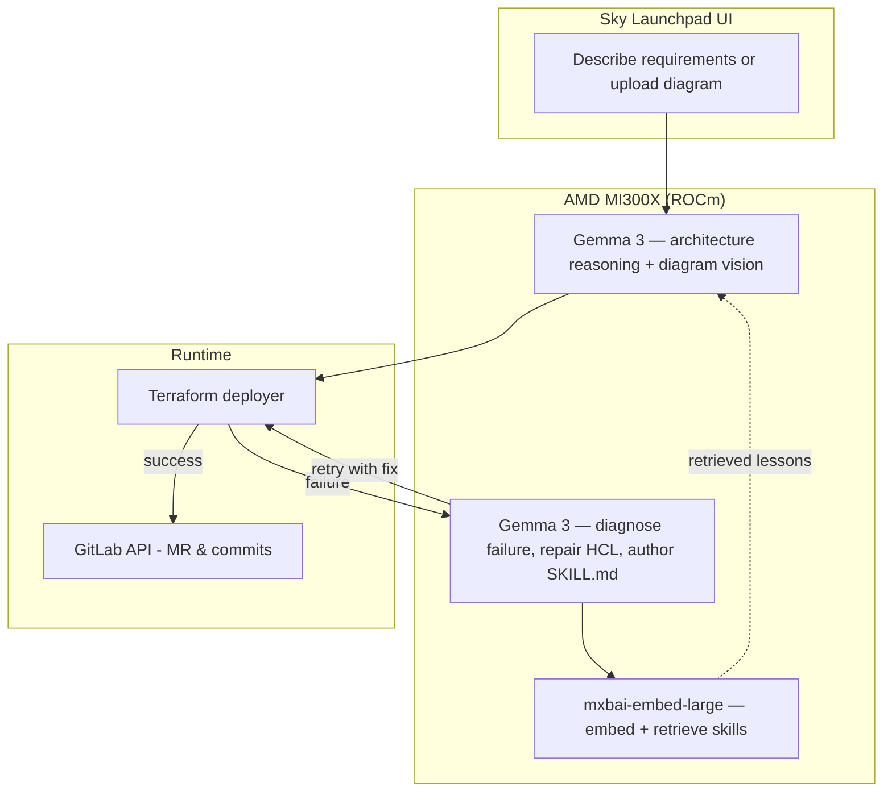

# Sky Launchpad

**Infrastructure that learns from its own failures.** Turn **natural language** or **uploaded diagrams** into **multi-cloud Terraform**, **deploy for real**, then **save proven code to GitLab** — powered end to end by **Gemma 3 running on an AMD Instinct MI300X**.

- **Primary UX:** Web app under [`project/`](project/) (Vite + FastAPI): architecture → code → **real `terraform apply`** (AWS/GCP) → GitLab MR on success (**deploy-first, validate-then-save**).
- **GitLab-native assets:** Custom **flow**, **chat agent**, **skills**, **chat rules**, and **MR review** instructions live in this repo for Duo-driven workflows inside GitLab.

## Built for the AMD Developer Hackathon: ACT II — Unicorn Track

Everything runs on AMD silicon, and **AMD is load-bearing for both halves of the self-improving loop** — not a bolt-on accelerator:

| Role | Model | Where |
|---|---|---|
| Architecture generation | **Gemma 3** (`gemma3:12b`) | Ollama on ROCm (MI300X) |
| Failure repair + skill authoring | **Gemma 3** | Ollama on ROCm (MI300X) |
| Diagram vision (Gemma 3 is natively multimodal) | **Gemma 3** | Ollama on ROCm (MI300X) |
| Skill-retrieval embeddings | **mxbai-embed-large** (1024-d) | Ollama on ROCm (MI300X) |
| Speech-to-text | **openai/whisper-large-v3** | PyTorch-ROCm (MI300X) |

No hosted inference: every token and every vector is computed on the MI300X. One open model in three roles, plus our own Whisper, on a single GPU. Everything speaks the OpenAI wire format ([`project/backend/llm_client.py`](project/backend/llm_client.py)), so `LLM_PROVIDER=fireworks` swaps to a managed AMD-hosted API with zero code change — used only where there is no GPU (Cloud Run).

**Kill the GPU and vector retrieval dies with it.** Embeddings have exactly one model, because vectors from different models aren't comparable. When the embedding endpoint is down, [`skydb.find_similar_skills`](skydb/__init__.py) degrades to lexical matching rather than poisoning the index with a foreign vector space. Semantic recall exists *because* of the AMD GPU.

### The self-improving loop

When a deployment **fails**, Sky Launchpad doesn't just patch and forget. It **learns**:

1. **[`deployer/log_collector.py`](deployer/log_collector.py)** gathers the Terraform error **plus real GCP Cloud Logging** entries.
2. **[`deployer/repair_agent.py`](deployer/repair_agent.py)** hands that context to **Gemma 3**, which diagnoses the root cause, fixes the HCL, and **authors a new generalized `SKILL.md`**. Its persona is declared in [`deployer/AGENTS.md`](deployer/AGENTS.md).
3. **[`deployer/skill_library.py`](deployer/skill_library.py)** persists the lesson to **both** a versioned `skills/learned/<slug>/SKILL.md` **and** a retrieval index, embedding it on the MI300X.
4. **Transfer:** the next deployment retrieves matching learned skills by vector similarity and injects them into generation — so the **same failure never happens twice**.
5. **[`project/backend/narration.py`](project/backend/narration.py)** streams a live text narration of the loop over a WebSocket (the browser speaks it aloud).

The system becomes more useful the more it is used — with **no human editing skills**. Learned-skill metrics are exposed at `GET /api/skills/learned`.

### Run it

AMD gives you two different environments, and they need different launch paths.

**On the free hackathon pod** (`notebooks.amd.com/hackathon`) — a managed JupyterLab container. You are root *inside a container*, so `docker run` is unavailable. Everything installs as a plain process:

```bash
bash scripts/pod_up.sh          # Ollama (ROCm) + Gemma 3 + embeddings + Whisper
bash scripts/pod_up.sh --check  # just probe the environment, install nothing
bash scripts/pod_down.sh        # stop the GPU clock (8h per rolling 24h)
```

**On an AMD Developer Cloud GPU Droplet** — a real VM with root, Docker, and a public IP:

```bash
docker compose -f docker/docker-compose.amd.yml up
```

Both serve the **same models**, so the vector index stays valid across them.

**Prove AMD silicon is doing the work:**

```bash
rocm-smi
ollama ps        # PROCESSOR column must read GPU, not CPU

curl localhost:11434/v1/embeddings -H 'Content-Type: application/json' \
  -d '{"model":"mxbai-embed-large","input":"compute api disabled"}' \
  | jq '.data[0].embedding | length'      # -> 1024
```

**One-time**, after creating the Atlas vector index with `numDimensions: 1024`:

```bash
python3 scripts/migrate_vector_index.py
```

**No GPU at all?** Same app, managed AMD-hosted models, zero code change — but this one costs money:

```bash
export LLM_PROVIDER=fireworks FIREWORKS_API_KEY=...
```

## How it works



1. User selects **AWS, GCP, or Azure** (UI) and enters requirements **or** uploads an architecture image (**Gemma 3** reads the diagram directly — it is natively multimodal, so vision and structured output happen in one call).
2. **Gemma 3 on the MI300X** produces architecture JSON, informed by **`AGENTS.md`**, **`skills/`**, and any **learned skills** retrieved by vector similarity. Terraform itself is rendered by [`deployer/iac_generator.py`](deployer/iac_generator.py) (templating, no LLM).
3. **FastAPI** runs **`terraform init/plan/apply`** against the user’s cloud using encrypted stored credentials (`deployer/` module at repo root).
4. On **success**, validated files are committed and a **merge request** is opened via the **GitLab REST API**. On **failure**, the repair loop runs and the lesson is embedded back into step 2.

> An optional GitLab-native surface ([`flows/`](flows/), [`agents/`](agents/), [`.gitlab/duo/`](.gitlab/duo/)) drives the same work from inside GitLab via Duo. It is not part of the self-improving loop — see [Models & licensing](#models--licensing).

## Repository layout

| Path | Purpose |
|------|---------|
| [`project/`](project/) | **React + Vite** frontend and **FastAPI** backend (`project/backend/`) |
| [`docker/`](docker/) | **ROCm** compose stack (droplet path): `ollama`, `whisper`, `backend` |
| [`deployer/`](deployer/) | Credential handling, Terraform workspace, deploy / retry / GitLab save |
| [`skydb/`](skydb/) | MongoDB Atlas store + Vector Search retrieval (local JSON fallback) |
| [`flows/`](flows/) | `skyrchitect-iac-generator.yaml` — 3-step Duo flow |
| [`agents/`](agents/) | Interactive Duo chat agent definition |
| [`skills/`](skills/) | Five SKILL.md modules (Terraform GCP, security, cost, patterns, voice) |
| [`.gitlab/duo/`](.gitlab/duo/) | `chat-rules.md`, MR review instructions |
| [`examples/terraform/`](examples/terraform/) | Reference Terraform implementations |
| [`Dockerfile`](Dockerfile), [`cloudrun-nginx.conf`](cloudrun-nginx.conf) | **GCP Cloud Run** image: nginx + static UI + uvicorn |

## GitLab Duo quick start (flow in GitLab)

1. Import or fork this project into your GitLab group.
2. Enable **GitLab Duo** and **flow execution** (group settings).
3. **Automate → Flows → New flow** — paste [`flows/skyrchitect-iac-generator.yaml`](flows/skyrchitect-iac-generator.yaml).
4. Enable the flow; set triggers (mention / assign) per GitLab docs.
5. Optional: create the chat agent from [`agents/skyrchitect-chat-agent.md`](agents/skyrchitect-chat-agent.md).
6. Open an issue with the **Infrastructure Request** template and trigger the flow.

## Companion app quick start (`project/`)

```bash
cd project
cp .env.example .env   # then edit: LLM_PROVIDER, GITLAB_TOKEN, GITLAB_PROJECT_PATH, CORS_ORIGINS, VITE_API_URL

pip install -r backend/requirements.txt
npm install && npm run dev    # UI → http://localhost:5173

# second terminal, from project/
uvicorn backend.api.main:app --reload --host 0.0.0.0 --port 8000
```

Deploy and credential routes inject the **monorepo root** into `sys.path` so the **`deployer/`** package imports correctly.

## Deploying the app to GCP (Cloud Run)

From the **repository root** (not `project/`):

```bash
gcloud builds submit --tag REGION-docker.pkg.dev/PROJECT/REPO/skyrchitect:latest .
gcloud run deploy skyrchitect --image REGION-docker.pkg.dev/PROJECT/REPO/skyrchitect:latest --region REGION --allow-unauthenticated --port 8080
```

Set **`VITE_API_URL`** at **Docker build time** to your Cloud Run HTTPS URL so the SPA calls the same origin’s `/api` proxy correctly. Pass secrets (**`FIREWORKS_API_KEY`**, **`GITLAB_TOKEN`**, etc.) as Cloud Run environment variables—not in git. On Cloud Run there is no GPU, so set `LLM_PROVIDER=fireworks`.

## Example Terraform (reference)

- [Three-tier web app](examples/terraform/gcp-three-tier-webapp/)
- [Serverless API](examples/terraform/gcp-serverless-api/)
- [Data pipeline](examples/terraform/gcp-data-pipeline/)

## Technology

| Layer | Stack |
|-------|--------|
| Hackathon platform | **GitLab Duo** (flows, agents, skills, chat rules) |
| Companion backend | **FastAPI**, **Terraform** CLI, **GitLab REST** |
| Companion frontend | **React 18**, **TypeScript**, **Vite**, **Tailwind** |
| Inference (GPU) | **Gemma 3** + **mxbai-embed-large** on **Ollama / ROCm / AMD MI300X** |
| Inference (managed fallback) | **Fireworks AI** (AMD-hosted) |
| Vision (diagrams) | **Gemma 3** (natively multimodal) |
| Skill retrieval | **MongoDB Atlas Vector Search** (1024-d, cosine) |
| App hosting (fallback) | **Google Cloud Run**, **Artifact Registry**, **Cloud Build** |
| Voice | **Whisper** (input) + browser SpeechSynthesis (output) |

## Models & licensing

Every model in the inference path is open-weight and self-hosted on the MI300X. We
distinguish **open weights** from **OSI open source**, because they are not the same
thing and Gemma is the case that matters:

| Component | License | Notes |
|---|---|---|
| **Gemma 3** (`gemma3:12b`) | [Gemma Terms of Use](https://ai.google.dev/gemma/terms) | **Open weights, not OSI.** The Gemma *code* is Apache 2.0; the *weights* are not. Gated on Hugging Face — pulling via Ollama's registry avoids the token. Commercial use permitted, subject to the prohibited-use policy. |
| **mxbai-embed-large-v1** | Apache 2.0 | Fully OSI. Natively 1024-d. |
| **openai/whisper-large-v3** | Apache 2.0 | Fully OSI, not gated. |
| **Ollama** | MIT | Serving runtime, bundles its own ROCm build. |
| **ROCm / PyTorch** | MIT / BSD-3 | AMD GPU stack. |
| **FastAPI**, **React**, **Vite**, **pymongo** | MIT / Apache 2.0 | Application frameworks. |
| **Terraform CLI** (1.7.5) | **BUSL-1.1** | Not open source since v1.6. We only *invoke* the CLI; we don't redistribute or resell it, so the non-compete clause doesn't bite. Swap in [OpenTofu](https://opentofu.org) (MPL-2.0) if you need a fully open toolchain. |

**One proprietary AI service remains in the repo, deliberately.** `POST /api/infrastructure/generate`
routes to **GitLab Duo** ([`project/backend/duo_client.py`](project/backend/duo_client.py)), which powers
the optional GitLab-native flow surface in [`flows/`](flows/), [`agents/`](agents/) and
[`.gitlab/duo/`](.gitlab/duo/). It is **not part of the self-improving loop**: the Terraform that
actually gets applied comes from [`deployer/iac_generator.py`](deployer/iac_generator.py) (pure
templating, zero LLM calls), and every model call in the failure→repair→learn→retrieve cycle runs on
the AMD GPU. Disable it by leaving `GITLAB_TOKEN` unset.

## Documentation

- [Architecture](docs/ARCHITECTURE.md)
- [Setup](docs/SETUP.md)
- [Flow reference](docs/FLOW_REFERENCE.md)
- [Demo script](docs/DEMO_SCRIPT.md)
- [Devpost / submission copy](DEVPOST.md)

## Contributing

See [CONTRIBUTING.md](CONTRIBUTING.md).

## License

[MIT License](LICENSE).
