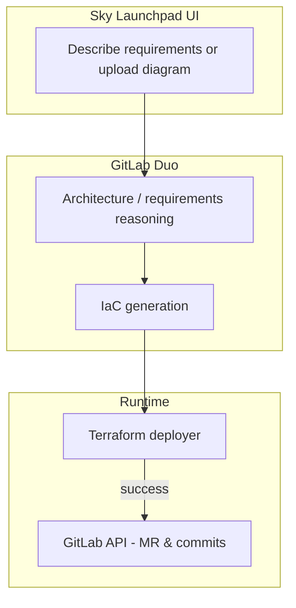

# Sky Launchpad

**AI-powered cloud architect:** turn **natural language** or **uploaded diagrams** into **multi-cloud Terraform**, **deploy for real**, then **save proven code to GitLab**—orchestrated by the **[GitLab Duo Agent Platform](https://docs.gitlab.com/user/duo_agent_platform/)** with a **React + FastAPI** companion app.

- **Primary UX:** Web app under [`project/`](project/) (Vite + FastAPI): architecture → code → **real `terraform apply`** (AWS/GCP) → GitLab MR on success (**deploy-first, validate-then-save**).
- **GitLab-native assets:** Custom **flow**, **chat agent**, **skills**, **chat rules**, and **MR review** instructions live in this repo for Duo-driven workflows inside GitLab.

## 🆕 Hackathon build: the self-improving loop (Continual Learning)

> **New work for the 2026 AI Engineer World's Fair Hackathon.** Everything above is pre-existing scaffolding; the feature below is what was built at the event.

When a deployment **fails**, Sky Launchpad no longer just patches and forgets. It now **learns**:

1. **[`deployer/log_collector.py`](deployer/log_collector.py)** gathers the Terraform error **plus real GCP Cloud Logging** entries.
2. **[`deployer/antigravity_client.py`](deployer/antigravity_client.py)** calls the **Gemini Interactions API** to spin up an **Antigravity managed agent** (`antigravity-preview-05-2026`) in an ephemeral Google-hosted Linux env. It diagnoses root cause, fixes the HCL, and **authors a new generalized `SKILL.md`**. The agent's `env_id` (**stateful memory**) is reused across retries; persona/skills are declared via [`deployer/AGENTS.md`](deployer/AGENTS.md). A direct `gemini-3.5` fallback keeps it running if the preview API is unavailable.
3. **[`deployer/skill_library.py`](deployer/skill_library.py)** persists the lesson to **both** a versioned `skills/learned/<slug>/SKILL.md` **and** a retrieval index.
4. **Transfer:** the next deployment retrieves matching learned skills (`load_learned_skills` in [`project/backend/skills_loader.py`](project/backend/skills_loader.py)) and injects them into generation — so the **same failure never happens twice**.
5. **[`project/backend/gemini_live.py`](project/backend/gemini_live.py)** streams a **Gemini Live API** voice narration of the loop in real time (toggle on the deploy page).

The system becomes more useful the more it is used — with **no human editing skills**. Learned-skill metrics are exposed at `GET /api/skills/learned`.

## How it works



1. User selects **AWS, GCP, or Azure** (UI) and enters requirements **or** uploads an architecture image (**Claude Opus** vision → text, then **Duo** for structured output).
2. **GitLab Duo** (Chat GraphQL primary; optional `glab duo cli`) produces architecture JSON and Terraform, informed by **`AGENTS.md`**, **`.gitlab/duo/chat-rules.md`**, and **`skills/`**.
3. **FastAPI** runs **`terraform init/plan/apply`** against the user’s cloud using encrypted stored credentials (`deployer/` module at repo root).
4. On **success**, validated files are committed and a **merge request** is opened via the **GitLab REST API**.

## Repository layout

| Path | Purpose |
|------|---------|
| [`project/`](project/) | **React + Vite** frontend and **FastAPI** backend (`project/backend/`) |
| [`deployer/`](deployer/) | Credential handling, Terraform workspace, deploy / retry / GitLab save |
| [`flows/`](flows/) | `skyrchitect-iac-generator.yaml` — 3-step Duo flow |
| [`agents/`](agents/) | Interactive Duo chat agent definition |
| [`skills/`](skills/) | Five SKILL.md modules (Terraform GCP, security, cost, patterns, voice) |
| [`.gitlab/duo/`](.gitlab/duo/) | `chat-rules.md`, MR review instructions |
| [`examples/terraform/`](examples/terraform/) | Reference Terraform implementations |
| [`Dockerfile`](Dockerfile), [`cloudrun-nginx.conf`](cloudrun-nginx.conf) | **GCP Cloud Run** image: nginx + static UI + uvicorn |

## GitLab Duo quick start (flow in GitLab)

1. Import or fork this project into your GitLab group.
2. Enable **GitLab Duo** and **flow execution** (group settings).
3. **Automate → Flows → New flow** — paste [`flows/skyrchitect-iac-generator.yaml`](flows/skyrchitect-iac-generator.yaml).
4. Enable the flow; set triggers (mention / assign) per GitLab docs.
5. Optional: create the chat agent from [`agents/skyrchitect-chat-agent.md`](agents/skyrchitect-chat-agent.md).
6. Open an issue with the **Infrastructure Request** template and trigger the flow.

## Companion app quick start (`project/`)

```bash
cd project
cp .env.example .env   # then edit: ANTHROPIC_API_KEY, ANTHROPIC_MODEL, GITLAB_TOKEN, GITLAB_PROJECT_PATH, CORS_ORIGINS, VITE_API_URL

pip install -r backend/requirements.txt
npm install && npm run dev    # UI → http://localhost:5173

# second terminal, from project/
uvicorn backend.api.main:app --reload --host 0.0.0.0 --port 8000
```

Deploy and credential routes inject the **monorepo root** into `sys.path` so the **`deployer/`** package imports correctly.

## Deploying the app to GCP (Cloud Run)

From the **repository root** (not `project/`):

```bash
gcloud builds submit --tag REGION-docker.pkg.dev/PROJECT/REPO/skyrchitect:latest .
gcloud run deploy skyrchitect --image REGION-docker.pkg.dev/PROJECT/REPO/skyrchitect:latest --region REGION --allow-unauthenticated --port 8080
```

Set **`VITE_API_URL`** at **Docker build time** to your Cloud Run HTTPS URL so the SPA calls the same origin’s `/api` proxy correctly. Pass secrets (**`ANTHROPIC_API_KEY`**, **`GITLAB_TOKEN`**, etc.) as Cloud Run environment variables—not in git.

## Example Terraform (reference)

- [Three-tier web app](examples/terraform/gcp-three-tier-webapp/)
- [Serverless API](examples/terraform/gcp-serverless-api/)
- [Data pipeline](examples/terraform/gcp-data-pipeline/)

## Technology

| Layer | Stack |
|-------|--------|
| Hackathon platform | **GitLab Duo** (flows, agents, skills, chat rules) |
| Companion backend | **FastAPI**, **Terraform** CLI, **GitLab REST** |
| Companion frontend | **React 18**, **TypeScript**, **Vite**, **Tailwind** |
| Vision (diagrams) | **Anthropic Claude Opus** (default `claude-opus-4-6`) |
| App hosting (demo) | **Google Cloud Run**, **Artifact Registry**, **Cloud Build** |
| Optional voice | **ElevenLabs** (skill + env when enabled) |

## Documentation

- [Architecture](docs/ARCHITECTURE.md)
- [Setup](docs/SETUP.md)
- [Flow reference](docs/FLOW_REFERENCE.md)
- [Demo script](docs/DEMO_SCRIPT.md)
- [Devpost / submission copy](DEVPOST.md)

## Contributing

See [CONTRIBUTING.md](CONTRIBUTING.md).

## License

[MIT License](LICENSE).
