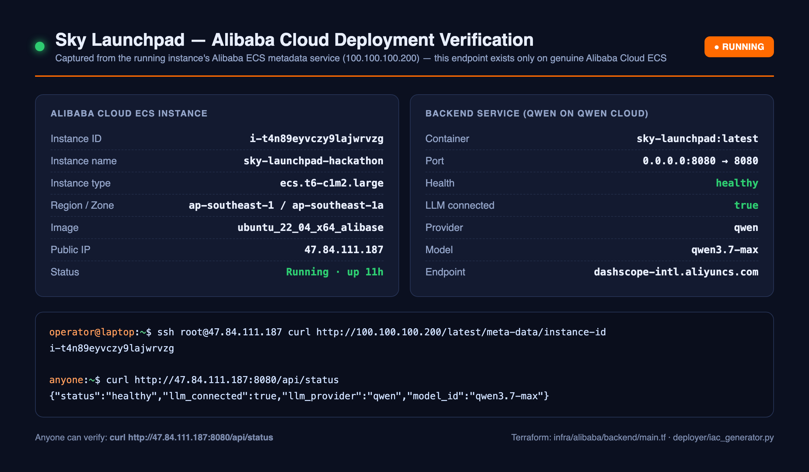

# Alibaba Cloud deployment proof

Sky Launchpad's proof backend is reproducibly provisioned on Alibaba Cloud by
the official `aliyun/alicloud` Terraform provider. The proof configuration is
intentionally public and contains no AccessKey values.

## Live verification (captured from the instance)



The panel above is captured straight from the running instance's **Alibaba ECS
metadata service** (`http://100.100.100.200/latest/meta-data/…`) — an endpoint
that only exists on genuine Alibaba Cloud ECS — plus the live health response.
Raw capture: [`alibaba-ecs-metadata.txt`](testing/screenshots/deployment/alibaba-ecs-metadata.txt).

| From Alibaba's metadata service | Value |
|---|---|
| Instance ID | `i-t4n89eyvczy9lajwrvzg` |
| Instance name | `sky-launchpad-hackathon` |
| Instance type | `ecs.t6-c1m2.large` |
| Region / Zone | `ap-southeast-1` / `ap-southeast-1a` |
| Image | `ubuntu_22_04_x64_20G_alibase_20260615.vhd` |
| Public IP | `47.84.111.187` |

**Anyone can verify, no credentials needed:**
```console
$ curl http://47.84.111.187:8080/api/status
{"status":"healthy","llm_connected":true,"llm_provider":"qwen","model_id":"qwen3.7-max"}
```

## Repository evidence

- [`infra/alibaba/backend/main.tf`](../infra/alibaba/backend/main.tf) calls the
  Alibaba Cloud ECS and VPC APIs to create the VPC, VSwitch, security group,
  key pair, and pay-as-you-go ECS host.
- [`infra/alibaba/backend/cloud-init.sh`](../infra/alibaba/backend/cloud-init.sh)
  prepares Docker on the ECS host.
- [`scripts/deploy-alibaba-backend.sh`](../scripts/deploy-alibaba-backend.sh)
  applies the Terraform plan, securely transfers the app, builds the container,
  and verifies the public `/health` endpoint.
- [`cloudrun-nginx.conf`](../cloudrun-nginx.conf) serves the React frontend and
  proxies the public health proof to the FastAPI backend.
- The architecture diagram is in [`README.md`](../README.md#architecture).

## Verification record — 2026-07-19 (deployed and live)

| Check | Result |
|---|---|
| Encrypted RAM AccessKey authentication | Passed |
| `terraform validate` | Passed |
| Live Alibaba Terraform apply | **Passed: 7 added** |
| ECS instance ID | `i-t4n89eyvczy9lajwrvzg` (`sky-launchpad-hackathon`) |
| Instance type / image | `ecs.t6-c1m2.large`, 2 vCPU / 4 GiB · `ubuntu_22_04_x64_20G_alibase_20260615` |
| Region / zone | `ap-southeast-1` / `ap-southeast-1a` |
| VPC / security group | `vpc-t4nkg9shyq43onpauck73` / `sg-t4n1exuje2mp1mqpl113` |
| Instance status | `Running` |
| Network exposure | App `8080` public; SSH `22` restricted to operator `/32` |
| Container | `sky-launchpad:latest` (631 MB), `--restart unless-stopped` |
| **Public health URL** | **http://47.84.111.187:8080/health** → `{"status":"ok",...}` |
| **Public status URL** | **http://47.84.111.187:8080/api/status** → `llm_provider: qwen`, `model_id: qwen3.7-max`, `llm_connected: true` |
| Public application URL | http://47.84.111.187:8080 |
| Slack app backend | Points at this host (`SKY_API_URL`), verified end-to-end |

Anyone can confirm the backend is running on Alibaba Cloud, and that it is
wired to Qwen, with a single unauthenticated request:

```console
$ curl http://47.84.111.187:8080/api/status
{"status":"healthy","version":"1.0.0","agent_ready":true,
 "llm_connected":true,"llm_provider":"qwen","model_id":"qwen3.7-max"}
```

### Notes from this deployment

- An earlier apply had stopped with `Forbidden.RAM` on `vpc:CreateVpc` and
  `ecs:ImportKeyPair`; attaching `AliyunECSFullAccess` and `AliyunVPCFullAccess`
  to the deployment RAM user resolved it and the apply now completes.
- The image build had been failing since 2026-07-11 on `COPY AGENTS.md`: that
  file and `flows/` were removed with the GitLab Duo surface but the Dockerfile
  still referenced them. Both COPY lines are gone; the repair agent's persona
  ships at `deployer/AGENTS.md` via `COPY deployer/`.
- nginx serves the React app at `/`, which shadowed the FastAPI status document,
  so it is now also exposed at `/api/status` (see `cloudrun-nginx.conf`).

## Security and cost controls

- The RAM AccessKey remains encrypted on the operator machine and is never copied
  to the public ECS host.
- Terraform secrets are provided through environment variables, not source or
  state values.
- Public credential-upload and deployment endpoints require production
  authentication.
- ECS uses pay-as-you-go compute, pay-by-traffic networking, and `StopCharging`
  stopped mode.
- Release the proof environment after judging with
  `CONFIRM_ALIBABA_DESTROY=yes ./scripts/destroy-alibaba-backend.sh`.
