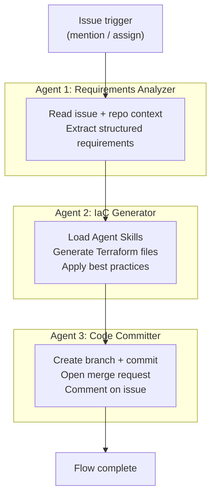

# Skyrchitect Architecture

This document explains how Skyrchitect works under the hood.

## Overview

Skyrchitect is a GitLab Duo Agent Platform project that uses a **custom flow** (multi-agent pipeline) and a **custom agent** (interactive chat) to generate GCP Terraform infrastructure from natural language descriptions.

## Custom Flow: IaC Generator

The flow is defined in [`flows/skyrchitect-iac-generator.yaml`](../flows/skyrchitect-iac-generator.yaml) using the [flow registry v1 specification](https://gitlab.com/gitlab-org/modelops/applied-ml/code-suggestions/ai-assist/-/blob/main/docs/flow_registry/v1.md).

### Flow Type

- **Environment**: `ambient` -- runs in the background without interactive human participation
- **Execution**: Runs in GitLab CI/CD on configured runners
- **Triggers**: Mention or assign the flow service account on an issue

### Agent Pipeline

### Agent 1: Requirements Analyzer

**Purpose**: Extract structured infrastructure requirements from the issue.

**Tools used**:
- `get_issue` -- Read the full issue body
- `list_issue_notes` -- Read comments for additional context
- `list_repository_tree` -- Check for existing Terraform files
- `get_repository_file` -- Read existing infrastructure configurations

**Output**: A JSON object with structured fields (project name, environment, services needed, scale, security requirements, budget, existing infrastructure state).

**Why this matters**: By producing structured JSON, Agent 2 gets clean, unambiguous input instead of trying to parse free-form text. The analyzer also detects existing Terraform in the repo so the generator can follow established conventions.

### Agent 2: IaC Generator

**Purpose**: Generate complete Terraform configurations.

**Tools used**:
- `get_repository_file` -- Read existing Terraform for convention matching
- `list_repository_tree` -- Understand repo structure
- `gitlab_blob_search` -- Search for patterns in existing code

**Skills loaded**: The GitLab Duo Agent Platform automatically loads relevant Agent Skills based on the task. For this agent, the following skills provide specialized knowledge:
- `terraform-gcp-generator` -- GCP provider syntax, resource patterns
- `gcp-security-hardening` -- Security best practices applied by default
- `gcp-cost-optimizer` -- Cost-efficient resource selections
- `gcp-architecture-patterns` -- Pattern selection based on requirements

**Output**: A JSON map of filename-to-content (e.g., `{"terraform/main.tf": "...", "terraform/variables.tf": "..."}`).

### Agent 3: Code Committer

**Purpose**: Commit the generated code and create a merge request.

**Tools used**:
- `create_commit` -- Creates a branch and commits all files in a single operation
- `create_merge_request` -- Opens an MR with architecture summary
- `create_issue_note` -- Posts a comment linking the MR to the original issue

**Workflow**:
1. Parse the generated code map and requirements
2. Create a branch: `infra/issue-{number}-{description}`
3. Commit all Terraform files as `create` actions
4. Open MR with architecture overview, cost estimate, deployment instructions
5. Comment on the original issue with a link to the MR

## Custom Agent: Interactive Chat

The Skyrchitect custom agent (configured via GitLab UI) provides an interactive alternative. Users chat with it in GitLab Duo Chat to:

- Ask architecture questions
- Generate Terraform snippets
- Review existing infrastructure MRs
- Get cost estimates

The agent has access to the same Agent Skills as the flow but works conversationally rather than autonomously.

## Agent Skills

Skills are `SKILL.md` files in `skills/<name>/SKILL.md`. GitLab Duo loads them automatically when an agent encounters a matching task. They can also be invoked explicitly with slash commands.

Skills provide:
- Detailed reference material (resource patterns, code templates)
- Best practices and checklists
- Decision guides (when to use which pattern)
- Cost estimation data

## Project Customization

### AGENTS.md

The root `AGENTS.md` provides project-wide context that all agents and flows read. It defines:
- Coding standards for generated Terraform
- Naming conventions
- Required labels
- Directory structure expectations

### Chat Rules

`.gitlab/duo/chat-rules.md` shapes how agents behave in chat:
- Default to GCP and Terraform
- Include cost estimates
- Apply security best practices

### MR Review Instructions

`.gitlab/duo/mr-review-instructions.yaml` defines automated review criteria applied when the Code Review flow reviews infrastructure MRs:
- Security checks (no hardcoded secrets, private IPs, least-privilege IAM)
- Cost checks (appropriate sizing, lifecycle policies)
- Code quality (variable descriptions, naming conventions, labels)

## Security Model

Flows use GitLab's [composite identity](https://docs.gitlab.com/user/duo_agent_platform/security/) mechanism:
- The flow runs as a service account with Developer role
- The service account can never access more than the user who triggered the flow
- All actions (commits, MRs) are attributed through composite identity
- No external API keys or credentials are needed -- the model is provided by GitLab Duo
